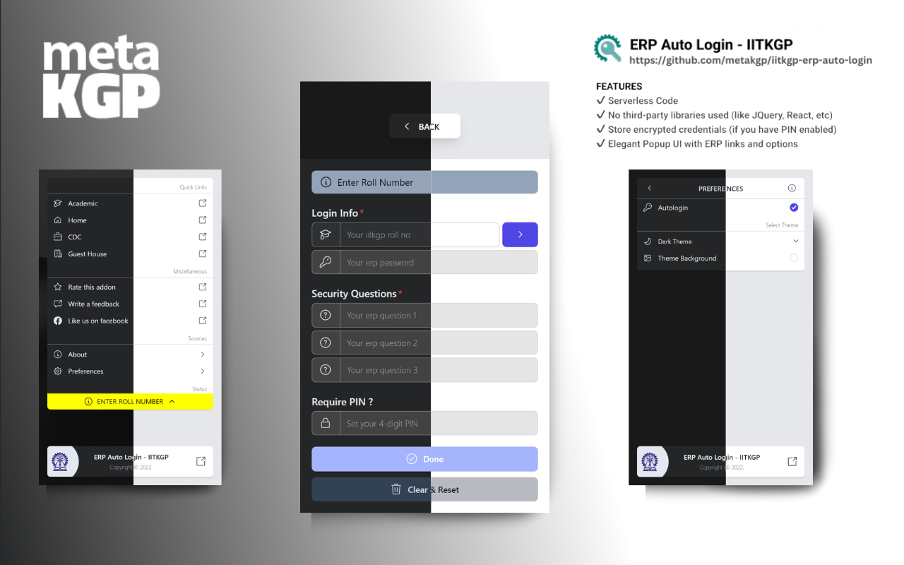

<div id="top"></div>

<!-- PROJECT SHIELDS -->
<!-- https://www.markdownguide.org/basic-syntax/#reference-style-links-->
<div align="center">

[![Contributors][contributors-shield]][contributors-url]
[![Forks][forks-shield]][forks-url]
[![Stargazers][stars-shield]][stars-url]
[![Issues][issues-shield]][issues-url]
[![MIT License][license-shield]][license-url]
[![Wiki][wiki-shield]][wiki-url]

</div>

<!-- PROJECT LOGO -->
<br />
<!-- UPDATE -->
<div align="center">
  <a href="https://github.com/metakgp/iitkgp-erp-auto-login">
     
  </a>

  <h3 align="center">ERP Auto Login - IITKGP</h3>

  <p align="center">
  <!-- UPDATE -->
    Minimial yet powerful and customizable autologin/autofill extension, for IIT Kharagpur enrolled students.
    <br />
    <a href="https://UPDATE.metakgp.org">Website</a>
    ·
    <a href="https://github.com/proffapt/iitkgp-erp-auto-login/issues">Request Feature / Report Bug</a>
  </p>
</div>


<!-- TABLE OF CONTENTS -->
<details>
<summary>Table of Contents</summary>

- [About The Project](#about-the-project)
  - [Supports](#supports)
- [Getting Started](#getting-started)
  - [Prerequisites](#prerequisites)
  - [Installation](#installation)
- [Usage](#usage)
- [Contact](#contact)
  - [Maintainer(s)](#maintainers)
  - [creators(s)](#creators)
- [Additional documentation](#additional-documentation)

</details>


<!-- ABOUT THE PROJECT -->
## About The Project
<!-- UPDATE -->
<div align="center">
  <a href="https://github.com/metakgp/iitkgp-erp-auto-login">
    
  </a>
</div>

ERP Auto Login is a chrome/ firefox extension which can be added to the browser. The extension stores the users confidentials like username, password and security questions and fills them up automatically whenever the user opens the ERP. It also sends the otp to the email, the user only need to fill up the OTP and can login.

<p align="right">(<a href="#top">back to top</a>)</p>

<div id="supports"></div>

### Supports:
<!-- UPDATE -->
1. Shells
    * `bash`
    * `zsh`
2. OS(s)
    * any `*nix`[`GNU+Linux` and `Unix`]

<p align="right">(<a href="#top">back to top</a>)</p>

## Getting Started

To set up a local instance of the application, follow the steps below.

### Prerequisites
The following dependencies are required to be installed for the project to function properly:
<!-- UPDATE -->
* npm
  ```sh
  npm install npm@latest -g
  ```
* web-ext
  ```sh
  npm install --global web-ext
  ```

<p align="right">(<a href="#top">back to top</a>)</p>

### Installation

- #### Build from source (Development)

  1. Clone the repository
     ```bash
     git clone https://github.com/siddsarkar/iitkgp-erp-auto-login-extension.git
     ```
  2. Cd into the repository
     ```bash
     cd iitkgp-erp-auto-login-extension
     ```
  3. Install dependencies
     ```bash
     npm install
     ```
  4. Build the extension and watch for changes
     ```bash
     npm run start
     ```
  5. The above step will create a `addon` folder with the extension in it.
      ```bash
      cd addon
      ```

  6. Run the extension using [web-ext](https://extensionworkshop.com/documentation/develop/getting-started-with-web-ext/) as below
     ```bash
     web-ext run # run the extension for firefox
     web-ext run -t chromium # (or) run the extension for chrome
     ```
  7. Check that the extension is loaded by opening the extensions page in Firefox `about:addons` or in Chrome `chrome://extensions/`.

- #### Build from source (Deployment)

  1. Clone the repository
     ```bash
     git clone https://github.com/siddsarkar/iitkgp-erp-auto-login-extension.git
     ```
  2. Cd into the repository
     ```bash
     cd iitkgp-erp-auto-login-extension
     ```
  3. Install dependencies
     ```bash
     npm install
     ```
  4. Build the extension and watch for changes
     ```bash
     npm run build-prod
     ```
  6. The above step will create a `addon` folder with the extension in it.

 

<p align="right">(<a href="#top">back to top</a>)</p>


<!-- USAGE EXAMPLES -->
## Usage
<!-- UPDATE -->
Screenshots of the extension

| .png>) | .png>) | .png>) |
| -------------------------------------------------------------------------------------------------------- | -------------------------------------------------------------------------------------------------------- | -------------------------------------------------------------------------------------------------------- |
| .png>) | .png>) | .png>) |

<p align="right">(<a href="#top">back to top</a>)</p>

## Contact

<p>
📫 Metakgp -
<a href="https://slack.metakgp.org">
  
</a>
<a href="mailto:metakgp@gmail.com">
  
</a>
<a href="https://www.facebook.com/metakgp">
  
</a>
<a href="https://www.linkedin.com/company/metakgp-org/">
  
</a>
<a href="https://twitter.com/metakgp">
  
</a>
<a href="https://www.instagram.com/metakgp_/">
  
</a>
</p>

### Maintainer(s)

The currently active maintainer(s) of this project.

<!-- UPDATE -->
- [Arpit Bhardwaj](https://github.com/proffapt)

### Creator(s)

Honoring the original creator(s) and ideator(s) of this project.

<!-- UPDATE -->
- [Siddhartha Sarkar](https://github.com/siddsarkar)

<p align="right">(<a href="#top">back to top</a>)</p>

## Additional documentation

  - [License](/LICENSE)
  - [Code of Conduct](/.github/CODE_OF_CONDUCT.md)
  - [Security Policy](/.github/SECURITY.md)
  - [Contribution Guidelines](/.github/CONTRIBUTING.md)

<p align="right">(<a href="#top">back to top</a>)</p>

<!-- MARKDOWN LINKS & IMAGES -->

[contributors-shield]: https://img.shields.io/github/contributors/metakgp/iitkgp-erp-auto-login.svg?style=for-the-badge
[contributors-url]: https://github.com/metakgp/iitkgp-erp-auto-login/graphs/contributors
[forks-shield]: https://img.shields.io/github/forks/metakgp/iitkgp-erp-auto-login.svg?style=for-the-badge
[forks-url]: https://github.com/metakgp/iitkgp-erp-auto-login/network/members
[stars-shield]: https://img.shields.io/github/stars/metakgp/iitkgp-erp-auto-login.svg?style=for-the-badge
[stars-url]: https://github.com/metakgp/iitkgp-erp-auto-login/stargazers
[issues-shield]: https://img.shields.io/github/issues/metakgp/iitkgp-erp-auto-login.svg?style=for-the-badge
[issues-url]: https://github.com/metakgp/iitkgp-erp-auto-login/issues
[license-shield]: https://img.shields.io/github/license/metakgp/iitkgp-erp-auto-login.svg?style=for-the-badge
[license-url]: https://github.com/metakgp/iitkgp-erp-auto-login/blob/master/LICENSE
[wiki-shield]: https://custom-icon-badges.demolab.com/badge/metakgp_wiki-grey?logo=metakgp_logo&style=for-the-badge
[wiki-url]: https://wiki.metakgp.org
[slack-url]: https://slack.metakgp.org